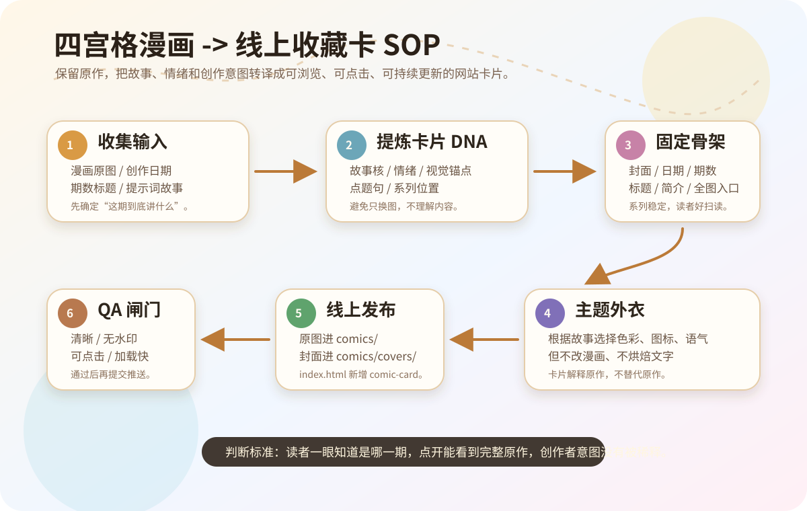
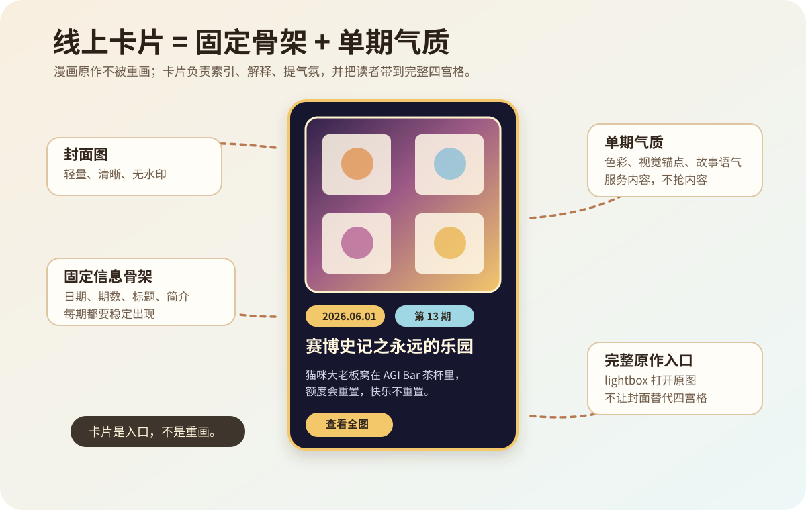
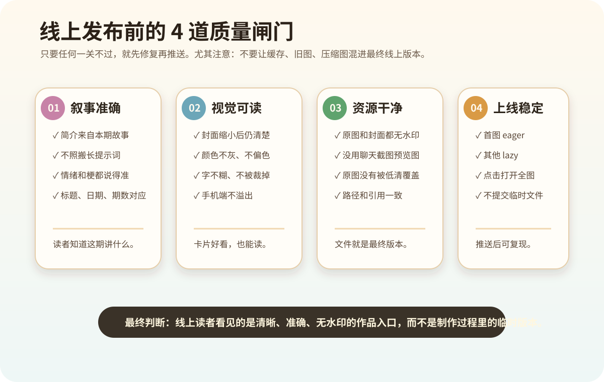

# 赛博史记

猫主持人宇宙漫画集。  
一个把 AI 知识推文、猫咪 IP、四宫格叙事和创作者手账慢慢收集起来的线上漫画项目。

线上访问：[xiangzi-cyber.github.io/saibo-shiji](https://xiangzi-cyber.github.io/saibo-shiji/)

## 项目里有什么

- `index.html`：线上漫画集首页，包含漫画专区与创作者专区。
- `style.css`：网站视觉样式。
- `comics/`：四宫格漫画原图。
- `comics/covers/`：网站卡片封面图，用于更快加载。
- `docs/comic-card-online-sop.md`：四宫格漫画转线上卡片的 SOP 复盘。
- `skills/saibo-comic-card-online/SKILL.md`：把这套流程沉淀成可复用 Skill。

## 创作方向

《赛博史记》不是单纯把漫画上传到网页，而是在探索一种“漫画作品卡”的表达方式：

1. 保留四宫格漫画原作。
2. 提炼每一期的故事、情绪和视觉锚点。
3. 生成适合网站浏览的封面图。
4. 用标题、日期、期数和简介建立系列索引。
5. 让读者从卡片进入完整漫画。

这个过程也是我对“萌宠主题插画设计系统”的一次持续实验：让宠物、日常、知识和情绪都能被温柔地记录下来。

## 线上卡片化 SOP

完整流程见：[赛博史记线上卡片化 SOP](docs/comic-card-online-sop.md)

GPT 生图配图 prompt 见：[GPT 生图配图 Brief](docs/comic-card-online-sop/gpt-image-briefs.md)

对应 Skill 见：[saibo-comic-card-online](skills/saibo-comic-card-online/SKILL.md)

### 1. 从漫画到线上卡片

### 2. 线上卡片结构

### 3. 发布前质量闸门

## 这套 SOP 的边界

当前 SOP 只覆盖线上图片卡片流程：

- 覆盖：网站卡片、封面图、原图 lightbox、故事简介、线上 QA。
- 不覆盖：A5/PDF 打印排版、打印安全区、打印店交付文件。

这样做是为了让线上更新流程保持轻、快、清楚，避免把打印规则混进网站发布。

## 作者

赛博史记系列四宫格漫画 by 小金鱼箱子

